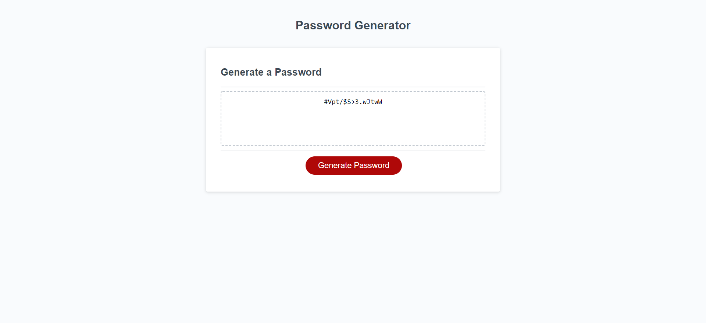

# Password Generator

## Table of Contents

- [Description](#description)
- [Visuals](#visuals)
- [Resources](#resources)

## Description

Password generator using assigned starter code. Accepts a desired password length, and various character sets. Then generates a password using the desired variables, and outputs it to the text area window. Features checks to prevent invalid values from interfering with proper exexcution of the code.

## Visuals

### Password generator upon launch

### Password generator after being executed

## Resources

[Live Site](https://bureizu742.github.io/password-generator/)

[Repository](https://github.com/Bureizu742/password-generator)